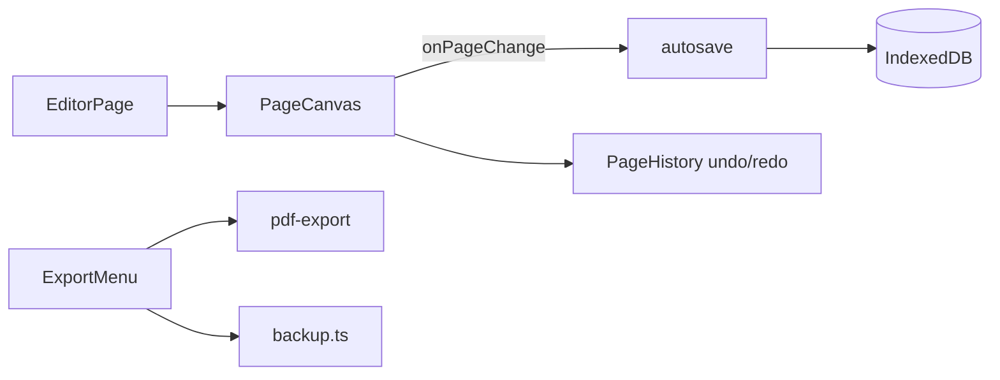

# Architecture — Forma `formacursor`

**Version** : 0.25.1 · **Branche** : `formacursor`

## Vue d’ensemble

PWA local-first (React 19 + Vite 8 + Dexie + Canvas 2D). Données dans IndexedDB ; export `.forma` ZIP ; pas de backend obligatoire.

```
src/
├── canvas/          Rendu page (PageCanvas, pool vue continue)
├── pages/           Routes (Library, Editor, Settings…)
├── components/      UI (toolbar, panels, library)
├── lib/             Logique métier pure (export, sélection, PDF, backup)
├── services/        Persistance + autosave + library API
├── stores/          Zustand (éditeur, settings, toasts)
├── db/              Dexie schema + migrations
└── hooks/           Pan/zoom, PWA, raccourcis
```

## Fichiers les plus volumineux (>400 lignes)

| Lignes | Fichier | Rôle | Dette |
|--------|---------|------|-------|
| ~1400 | `canvas/PageCanvas.tsx` | Gestes, 3 calques canvas, sélection | **Priorité découpage** |
| ~1050 | `pages/EditorPage.tsx` | Shell éditeur, zoom CSS, pan | Extraire hooks/layout |
| ~920 | `pages/LibraryPage.tsx` | Bibliothèque, import drop | Extraire listes/modals |
| ~775 | `pages/SettingsPage.tsx` | Paramètres + import backup | OK court terme |
| ~576 | `lib/selection-engine.ts` | Lasso, rotation, bounds | Stable, tests solides |
| ~567 | `lib/backup.ts` | Import/export `.forma` | Couplé Dexie |
| ~527 | `services/library.ts` | CRUD carnets/dossiers | Frontière DB claire |

**Seuil alerte** : >500 lignes → planifier extraction avant nouveau gros feature.

## Modules clés

| Module | Responsabilité | Dépendances |
|--------|----------------|-------------|
| `db/index.ts` | Dexie v7, migrations | `dataurl-migration` |
| `lib/backup.ts` + `forma-package.ts` | ZIP `.forma`, merge/replace | Dexie, JSZip |
| `lib/assets.ts` | Blobs, hydration pages | Dexie `assets` |
| `canvas/PageCanvas.tsx` | Rendu + input | `page-render`, `selection-engine` |
| `lib/page-render.ts` | Draw strokes/shapes/texte | `stroke-render` |
| `lib/pdf-export.ts` | Export raster PDF | `page-render`, pdf-lib |
| `lib/pdf-vector-export.ts` | Traits vectoriels + fond raster | pdf-lib |
| `services/autosave.ts` | Debounce 2s, flush | `pages` service |
| `lib/document-lock.ts` | Verrou multi-onglets | localStorage |
| `lib/dirty-rect.ts` | Clips invalidation encre | `selection-engine` |

## Flux données éditeur



## Rendu canvas (3 calques)

1. **Background** — template / PDF page (invalidation `bgDirtyRef`)
2. **Ink** — traits, formes, images (`renderPageContent`, clips partiels)
3. **Overlay** — lasso, sélection, poignée rotation (RAF coalescé)

**Zoom / pan** : CSS `scale` + `translate` sur conteneur (`EditorPage`) — **pas de redraw canvas** au zoom.

## Plan de découpage progressif (sans refactor massif)

Ordre recommandé — **un module à la fois, tests avant/après** :

1. **`PageCanvas.tsx`** → extraire :
   - `usePageCanvasHistory.ts` (undo/redo, batch)
   - `usePageCanvasPointer.ts` (pointer down/move/up)
   - `selection-overlay.ts` (paint overlay + handles)
2. **`EditorPage.tsx`** → `useEditorNavigation.ts`, `EditorChrome.tsx`
3. **`backup.ts`** → séparer `forma-import.ts` / `forma-export.ts`
4. **`LibraryPage.tsx`** → composants liste + modals
5. **PDF** → unifier `pdf-export` + `pdf-vector-export` derrière façade

**Ne pas faire** : WebGL, sync backend, IA dans ce cycle.

## Préparation future (docs only)

| Sujet | Fichier | Statut |
|-------|---------|--------|
| Migrations Dexie | `docs/MIGRATIONS.md` | v7 livré |
| Déploiement preview | `docs/DEPLOY.md` | Vercel branch `formacursor` |
| Sync API | `docs/SYNC_API.md` | Contrat seulement |
| WebGL | — | Étude non lancée |
| IA | — | Panneaux UI existants, non branchés |

## Tests

| Couche | Fichiers |
|--------|----------|
| Unit | `src/lib/*.test.ts`, `src/db/schema.test.ts` |
| E2E | `tests/e2e/*.spec.ts` (Chromium CI) |
| Bench advisory | `scripts/stroke-bench-ci.mjs` (warning CI) |

Voir [CONFORMITE.md](./CONFORMITE.md).
