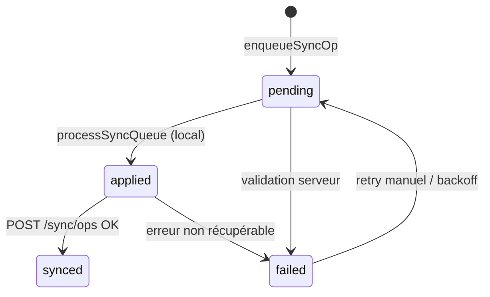

# Contrat API sync cloud (futur) — Forma 0.23.1

Document de référence pour l’intégration Supabase / API REST. **Aucun backend n’est livré en 0.23.x** ; le client utilise `src/services/sync-queue.ts` en local uniquement.

## Modèle côté client

Chaque entrée de la queue (`SyncOperation`) :

| Champ | Type | Description |
|-------|------|-------------|
| `id` | `string` | Identifiant stable de l’op (souvent = `entityId`) |
| `type` | `page_update` \| `notebook_update` \| `page_delete` | Type d’événement |
| `entityId` | `string` | Page ou carnet ciblé |
| `payload` | `unknown` | Patch minimal (ex. `{ name }`, `{ notebookId }`) |
| `createdAt` | `number` | Horodatage ms (ordre + pruning) |
| `retries` | `number` | Compteur d’échecs API |
| `status` | voir ci-dessous | Cycle de vie local → cloud |

### Statuts (`SyncOpStatus`)

| Statut | Signification |
|--------|----------------|
| `pending` | En attente de traitement local / envoi |
| `applied` | Appliqué localement (simulation ou ack client) |
| `synced` | Confirmé par le serveur |
| `failed` | Échec définitif ou après max retries |

Flux cible :



## Limites client (0.23.1)

- **MAX_OPS** : 500 entrées max (les plus anciennes supprimées).
- **Rétention** : ops avec `createdAt` &gt; 30 jours supprimées au chargement, à l’enqueue et après `processSyncQueue`.
- **Déduplication** : une seule op par couple `(type, entityId)` ; un nouvel enqueue remplace l’entrée et remet `status: pending`, `retries: 0`.

## Endpoints proposés (Supabase / Edge)

### `POST /v1/sync/ops`

Envoi d’un lot d’opérations `applied` (ou `pending` si le serveur valide l’idempotence).

**Request**

```json
{
  "deviceId": "uuid",
  "ops": [
    {
      "id": "page-abc",
      "type": "page_update",
      "entityId": "page-abc",
      "payload": { "notebookId": "nb-1" },
      "createdAt": 1717000000000
    }
  ]
}
```

**Response 200**

```json
{
  "accepted": ["page-abc"],
  "rejected": [],
  "serverTime": 1717000001000
}
```

Le client marque `synced` pour chaque id dans `accepted`, incrémente `retries` et laisse `applied` ou passe `failed` pour `rejected`.

### `GET /v1/sync/changes?since={cursor}`

Pull des changements distants (autres appareils). Réponse paginée avec curseur opaque.

**Response 200**

```json
{
  "cursor": "opaque-token",
  "changes": [
    {
      "type": "notebook_update",
      "entityId": "nb-1",
      "payload": { "name": "Cours" },
      "updatedAt": 1717000002000
    }
  ]
}
```

### Auth

- JWT utilisateur (Supabase Auth) dans `Authorization: Bearer`.
- RLS : `user_id` sur toutes les tables sync.

## Tables SQL (esquisse)

```sql
-- sync_ops : journal append-only côté serveur
create table sync_ops (
  id text not null,
  user_id uuid not null references auth.users,
  device_id text not null,
  op_type text not null check (op_type in ('page_update','notebook_update','page_delete')),
  entity_id text not null,
  payload jsonb,
  client_created_at bigint not null,
  inserted_at timestamptz default now(),
  primary key (user_id, id)
);
```

## Intégration prévue dans `processSyncQueue`

1. Sélectionner les ops `pending` → `applied` (comportement actuel).
2. `POST /v1/sync/ops` pour les `applied`.
3. Mettre à jour `synced` / `failed` selon la réponse ; backoff exponentiel sur `retries`.
4. `pruneQueue` puis persistance `localStorage` (`forma-sync-queue`).

Voir [LIMITES.md](./LIMITES.md) (section sync) et [CONFORMITE.md](./CONFORMITE.md) (SYNC-1).
